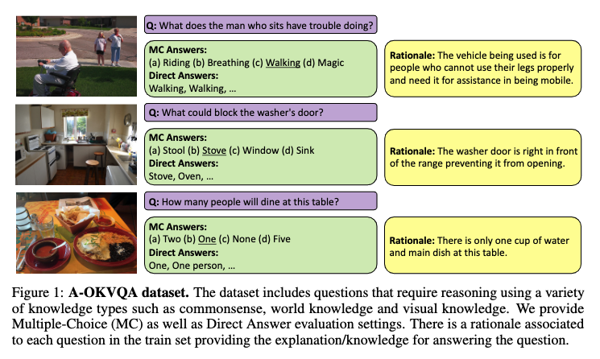

# A-OKVQA

Official repository for **A-OKVQA: A Benchmark for Visual Question Answering using World Knowledge**.

Links: [[Paper]]() [[Website]](https://aokvqa.allenai.org) [[Leaderboard]](https://leaderboard.allenai.org/aokvqa)

### Abstract

The Visual Question Answering (VQA) task aspires to provide a meaningful testbed for the development of AI models that can jointly reason over visual and natural language inputs. Despite a proliferation of VQA datasets, this goal is hindered by a set of common limitations. These include a reliance on relatively simplistic questions that are repetitive in both concepts and linguistic structure, little world knowledge needed outside of the paired image, and limited reasoning required to arrive at the correct answer. We introduce A-OKVQA, a crowdsourced dataset composed of a diverse set of about 25K questions requiring a broad base of commonsense and world knowledge to answer. In contrast to the existing knowledge-based VQA datasets, the questions generally cannot be answered by simply querying a knowledge base, and instead require some form of commonsense reasoning about the scene depicted in the image.  We demonstrate the potential of this new dataset through a detailed analysis of its contents and baseline performance measurements over a variety of state-of-the-art vision–language models.



<hr>

#### Table of Contents

- [Getting started](#getting-started)
  * [Downloading the dataset](#downloading-the-dataset)
- [Evaluation](#evaluation)
  * [Leaderboard](#leaderboard)
- [Codebase](#codebase)
  * [Preparing data](#preparing-data)
  * [Models and Predictions](#models-and-predictions)
    + [Heuristics](#heuristics)
    + [Transfer Learning Experiments](#transfer-learning-experiments)
    + [Querying GPT-3](#querying-gpt-3)
    + [ClipCap](#clipcap)
    + [Generating Captions & Rationales](#generating-captions--rationales)

<hr>

## Getting started

```bash
git clone --single-branch --recurse-submodules https://github.com/allenai/aokvqa.git

cd aokvqa
export PYTHONPATH=.

conda env create --name aokvqa
conda activate aokvqa
```

### Downloading the dataset

```bash
export AOKVQA_DIR=./datasets/aokvqa/
mkdir -p ${AOKVQA_DIR}

curl -L -s https://prior-datasets.s3.us-east-2.amazonaws.com/aokvqa/aokvqa_v1p0.tar.gz | tar xvz -C ${AOKVQA_DIR}
```

<details> <summary><b>Downloading images/annotations from COCO 2017</b></summary>

```bash
export COCO_DIR=./datasets/coco/
mkdir -p ${COCO_DIR}

for split in train val test; do
    wget "http://images.cocodataset.org/zips/${split}2017.zip"
    unzip "${split}2017.zip" -d ${COCO_DIR}; rm "${split}2017.zip"
done

wget http://images.cocodataset.org/annotations/annotations_trainval2017.zip
unzip annotations_trainval2017.zip -d ${COCO_DIR}; rm annotations_trainval2017.zip
```

</details>

Loading our dataset is easy! Just grab our [aokvqa_utils.py](https://github.com/allenai/aokvqa/blob/main/aokvqa_utils.py) file and refer to the following code.

```python
import os
import aokvqa_utils

aokvqa_dir = os.getenv('AOKVQA_DIR')

train_dataset = aokvqa_utils.load_aokvqa(aokvqa_dir, 'train')
val_dataset = aokvqa_utils.load_aokvqa(aokvqa_dir, 'val')
test_dataset = aokvqa_utils.load_aokvqa(aokvqa_dir, 'test')
```

<details> <summary><b>Example dataset entry</b></summary>

```python
dataset_example = train_dataset[0]

print(dataset_example['question_id'])
# 22MexNkBPpdZGX6sxbxVBH

coco_dir = os.getenv('COCO_DIR')
image_path = aokvqa_utils.get_coco_path('train', dataset_example['image_id'], coco_dir)
print(image_path)
# ./datasets/coco/train2017/000000299207.jpg

print(dataset_example['question'])
print(dataset_example['choices'])
# What is the man by the bags awaiting?
# ['skateboarder', 'train', 'delivery', 'cab']

correct_choice = dataset_example['choices'][ dataset_example['correct_choice_idx'] ]
# Corrrect: cab

print(dataset_example['rationales'][0])
# A train would not be on the street, he would not have luggage waiting for a delivery, and the skateboarder is there and not paying attention to him so a cab is the only possible answer.
```

</details>

## Evaluation

Please prepare a `predictions_{split}-{setting}.json` file for each evaluation set (val and test splits, for both MC and DA settings) with the format: `{ question_id (str) : prediction (str) }`. Be sure this includes a prediction for **every** question in the evaluation set. You won't be able to run evaluation locally on test set predictions, since the ground-truth answers are hidden.

```python
import os
import json
import aokvqa_utils

aokvqa_dir = os.getenv('AOKVQA_DIR')
split = 'val'
multiple_choice = True  # Set False for DA
predictions_file = './path/to/predictions_val-mc.json'

eval_dataset = aokvqa_utils.load_aokvqa(aokvqa_dir, split)
predictions = json.load(open(predictions_file, 'r'))

acc = aokvqa_utils.eval_aokvqa(eval_dataset, predictions, multiple_choice=multiple_choice)
print(acc) # float
```

To compute metrics over a batch of predictions files (e.g. `./predictions/{model-name}_val-da.json`), you can instead run `python evaluate_predictions.py --aokvqa-dir ${AOKVQA_DIR} --split val --preds "./predictions/*_val-da.json"`. Add the `--multiple-choice` flag to run MC evaluation over (e.g. `*_val-mc.json`) files that have instead been generated for the multiple-choice setting.

### Leaderboard

You can submit predictions from your model to our leaderboard! Simply produce predictions files for each split and setting and [submit here](https://leaderboard.allenai.org/aokvqa). Remember that your model is not allowed to compare "choices" when predicting for the DA setting.

## Codebase

We provide all code and pretrained models necessary to replicate our experiments for Large-Scale Pretrained Models (sec. 5.2) and Rationale Generation (sec. 5.3).

### Preparing data

```bash
export FEATURES_DIR=./features/
mkdir -p ${FEATURES_DIR}
```

You can compute CLIP features for our vocabulary and dataset. These are most commonly used by our other experiments.

```bash
python data_scripts/encode_vocab_clip.py --vocab ${AOKVQA_DIR}/large_vocab_train.csv --model-type ViT-B/32 --out ${FEATURES_DIR}/clip-ViT-B-32_large_vocab.pt

for split in train val test; do
    python data_scripts/extract_clip_features.py --aokvqa-dir ${AOKVQA_DIR} --coco-dir ${COCO_DIR} --split ${split} --model-type ViT-B/32 --out ${FEATURES_DIR}/clip-ViT-B-32_${split}.pt
done
```

<details> <summary><b>For training ClipCap with a transformer mapping network</b></summary>

If you want to train our ClipCap models with the transformer mapping network (instead of an MLP, like we do), you'll also need to run `extract_clip_features.py` with `--model-type RN50x4`.

</details>

<details> <summary><b>For ResNet and BERT input features</b></summary>

Our ResNet and BERT classification experiments require these respective features instead of CLIP. To generate these, please run the following commands:

```bash
# ResNet
for split in train val test; do
    python data_scripts/extract_resnet_features.py --aokvqa-dir ${AOKVQA_DIR} --coco-dir ${COCO_DIR} --split ${split} --out ${FEATURES_DIR}/resnet_${split}.pt
done

# BERT
for split in train val test; do
    python data_scripts/extract_bert_features.py --aokvqa-dir ${AOKVQA_DIR} --split ${split} --out ${FEATURES_DIR}/bert_${split}.pt
done
```

</details>

### Models and Predictions

```bash
export LOG_DIR=./logs/
export PREDS_DIR=./predictions/
export PT_MODEL_DIR=./pretrained_models/
mkdir -p ${LOG_DIR} ${PREDS_DIR} ${PT_MODEL_DIR}
```

<details> <summary><b>Download our pretrained model weights</b></summary>

```bash
# Checkpoints for transfer learning experiments
curl -L -s https://prior-model-weights.s3.us-east-2.amazonaws.com/aokvqa/transfer_exp_checkpoints.tar.gz | tar xvz -C ${PT_MODEL_DIR}/aokvqa_models

# Checkpoints for ClipCap models (generating answers and rationales)
curl -L -s https://prior-model-weights.s3.us-east-2.amazonaws.com/aokvqa/clipcap_checkpoints.tar.gz | tar xvz -C ${PT_MODEL_DIR}/aokvqa_models
```

</details>

Below, we follow this prediction file naming scheme: `{model-name}_{split}-{setting}.json` (e.g. `random-weighted_val-mc.json` or `random-weighted_test-da.json`). As examples, we produce predictions on the validation set below.

#### Heuristics

```bash
# These scripts accept the same arguments.
# heuristics/random_unweighted.py
# heuristics/random_weighted.py
# heuristics/most_common_answer.py

python heuristics/random_unweighted.py --aokvqa-dir ${AOKVQA_DIR} --split val --mc --out ${PREDS_DIR}/random-unweighted_val-mc.json
# Exclude --mc for the direct answer setting
```

#### Transfer Learning Experiments

We use the following training/prediction scripts for the classifier, zero-shot, and contrastive experiments in Table 3.

```bash
## Training
python transfer_experiments/train.py --aokvqa-dir ${AOKVQA_DIR} --vocab ${AOKVQA_DIR}/large_vocab_train.csv --log-dir ${LOG_DIR}

--backbone clip --clip-model-type ViT-B/32 --train-features ${FEATURES_DIR}/clip-ViT-B-32_train.pt --val-features ${FEATURES_DIR}/clip-ViT-B-32_val.pt
--inputs question # OR --inputs image  # OR --inputs question image
# OR
--backbone resnet --train-features ${FEATURES_DIR}/resnet_train.pt --val-features ${FEATURES_DIR}/resnet_val.pt --inputs image
# OR
--backbone bert --train-features ${FEATURES_DIR}/bert_train.pt --val-features ${FEATURES_DIR}/bert_val.pt --inputs question

--objective classifier
# OR
--objective contrastive --vocab-features ${FEATURE_DIR}/clip-ViT-B-32_large_vocab.pt
```

You can make predictions for CLIP zero-shot or from a classifier/contrastive checkpoint trained above.

```bash
## Predicting
python transfer_experiments/predict.py --aokvqa-dir ${AOKVQA_DIR} --out ${PREDS_DIR}/clip-classifier_val-mc.json

--split val  # or test
--features ${FEATURE_DIR}/clip-ViT-B-32_val.pt  # adjust for backbone and eval split

--ckpt path/to/model.ckpt
# OR
--zero-shot --clip-model-type ViT-B/32
--inputs question  # OR --inputs image  # OR --inputs question image

--mc  # Multiple-choice. Exclude for direct-answer.

# IF classifier OR direct-answer
--vocab ${AOKVQA_DIR}/large_vocab_train.csv
# IF contrastive/zero-shot AND direct-answer
--vocab-features ${FEATURES_DIR}/clip-ViT-B-32_large_vocab.pt
```

#### Querying GPT-3

To follow our experiments which use GPT-3, you must have access to the [OpenAI API](https://openai.com/api/) (at cost). Please retrieve your [organization](https://beta.openai.com/account/org-settings) and [API](https://beta.openai.com/account/api-keys) keys and set them in your environment variables.

```bash
export OPENAI_ORG=....
export OPENAI_API_KEY=...
```

For producing predictions for both DA and MC settings, run:
```bash
python gpt3/query_gpt3.py --aokvqa-dir ${AOKVQA_DIR} --split val --out ${PREDS_DIR}/gpt3_val-da.json
python remap_predictions.py --aokvqa-dir ${AOKVQA_DIR} --split val --pred ${PREDS_DIR}/gpt3_val-da.json --out ${PREDS_DIR}/gpt3_val-mc.json
```

#### ClipCap

We have modified the [ClipCap](https://github.com/rmokady/CLIP_prefix_caption) codebase for our task of VQA. In particular, we have forked the original repo via [our ClipCap branch](https://github.com/allenai/aokvqa/tree/ClipCap) and [made additional changes](https://github.com/allenai/aokvqa/compare/1ad805a...ClipCap). This is already part of the codebase you cloned, assuming you included `--recurse-submodules` as directed above.

<details> <summary><b>Downloading pretrained models</b></summary>

```bash
# We use this model: MLP mapping network and finetuned GPT-2 (pretrained on COCO)
gdown 1IdaBtMSvtyzF0ByVaBHtvM0JYSXRExRX -O ${PT_MODEL_DIR}/clipcap_coco_weights.pt
```

</details>

```bash
# Finetuning on our dataset
python ClipCap/train.py --log-dir ${LOG_DIR}/clipcap --aokvqa-dir ${AOKVQA_DIR} --train-features ${FEATURES_DIR}/clip-ViT-B-32_train.pt --val-features ${FEATURES_DIR}/clip-ViT-B-32_val.pt --pretrained-model ${PT_MODEL_DIR}/clipcap_coco_weights.pt --generation-target answer --mapping mlp --finetune-gpt

# Predicting (e.g. for epoch 3)
python ClipCap/predict.py --log-dir ${LOG_DIR}/clipcap --epoch 3 --aokvqa-dir ${AOKVQA_DIR} --split val --eval-features ${FEATURES_DIR}/clip-ViT-B-32_val.pt --out ${PREDS_DIR}/clipcap_val-da.json
```

For the multiple-choice setting, adjust the following arguments:
```bash
# ClipCap/train.py: --log-dir ${LOG_DIR}/clipcap-mc --prompt-with-choices
# ClipCap/predict.py: --log-dir ${LOG_DIR}/clipcap-mc --map-to-choices --out ${PREDS_DIR}/clipcap_val-mc.json
```

<details> <summary><b>For training with a Transformer mapping network</b></summary>

```bash
# Grab the Transformer ClipCap weights (pretrained on COCO)
gdown 1GYPToCqFREwi285wPLhuVExlz7DDUDfJ -O ${PT_MODEL_DIR}/clipcap_transformer_weights.pt

# ClipCap/train.py: --train-features ${FEATURES_DIR}/clip-RN50x4_train.pt --pretrained-model ${PT_MODEL_DIR}/clipcap_transformer_weights.pt --mapping transformer
# ClipCap/predict.py: --eval-features ${FEATURES_DIR}/clip-RN50x4_val.pt
```

</details>

#### Generating Captions & Rationales

To generate rationales, we repeat the [above](#clipcap) ClipCap training and predictions, with some modifications. We only train one model (even between DA and MC settings).

```bash
mkdir -p ${LOG_DIR}/gpt3-inputs

# ClipCap/train.py: --log-dir ${LOG_DIR}/clipcap-rationale --generation-target rationale
# Be sure to exclude --prompt-with-choices

# ClipCap/predict.py: --log-dir ${LOG_DIR}/clipcap-rationale --beam-search --out ${LOG_DIR}/gpt3-inputs/clipcap-rationales_val.json
# Be sure to exclude --map-to-choices
```

<details> <summary><b>Prompting GPT-3 with rationales</b></summary>

First see [Querying GPT-3](#querying-gpt-3) section above.

We should generate ground-truth rationale files:
```bash
for split in train val; do
    python gpt3/rationale_inputs.py --aokvqa-dir ${AOKVQA_DIR} --split ${split} --out logs/gpt3-inputs/rationales_${split}.json
done
```

You can prompt GPT-3 as described above, but with the following modified arguments:

```bash
# For prompting with ground-truth rationales:

# gpt3/query_gpt3.py: --train-context ${LOG_DIR}/gpt3-inputs/rationales_train.json --context ${LOG_DIR}/gpt3-inputs/rationales_val.json --out ${PREDS_DIR}/gpt3-rationales_val-da.json
# remap_predictions.py: --pred ${PREDS_DIR}/gpt3-rationales_val-da.json --out ${PREDS_DIR}/gpt3-rationales_val-mc.json

# For prompting with generated rationales:

# gpt3/query_gpt3.py: --train-context ${LOG_DIR}/gpt3-inputs/rationales_train.json --context ${LOG_DIR}/gpt3-inputs/clipcap-rationales_val.json --out ${PREDS_DIR}/gpt3-clipcap-rationales_val-da.json
# remap_predictions.py: --pred ${PREDS_DIR}/gpt3-clipcap-rationales_val-da.json --out ${PREDS_DIR}/gpt3-clipcap-rationales_val-mc.json
```

</details>

<details> <summary><b>Generating and prompting with captions</b></summary>

Please read everything else (above) in this section first.

We can generate COCO captions with the original ClipCap weights.

```bash
python ClipCap/predict_clipcap.py --ckpt ${PT_MODEL_DIR}/clipcap_coco_weights.pt --mapping mlp --aokvqa-dir ${AOKVQA_DIR} --split val --eval-features ${FEATURES_DIR}/clip-ViT-B-32_val.pt --beam-search --out logs/gpt3-inputs/clipcap-captions_val.json
```

We should also generate ground-truth captions (for train and val).

```bash
for split in train val; do
    python gpt3/caption_inputs.py --aokvqa-dir ${AOKVQA_DIR} --coco-dir ${COCO_DIR} --split ${split} --out ${LOG_DIR}/gpt3-inputs/captions_${split}.json
done
```

Query GPT-3 with original arguments and the following modifications, and produce predictions.

```bash
# For prompting with ground-truth captions:

# gpt3/query_gpt3.py: --train-context ${LOG_DIR}/gpt3-inputs/captions_train.json --context ${LOG_DIR}/gpt3-inputs/captions_val.json --out ${PREDS_DIR}/gpt3-captions_val-da.json
# remap_predictions.py: --pred ${PREDS_DIR}/gpt3-captions_val-da.json --out ${PREDS_DIR}/gpt3-captions_val-mc.json

# For prompting with generated captions:

# gpt3/query_gpt3.py: --train-context ${LOG_DIR}/gpt3-inputs/captions_train.json --context ${LOG_DIR}/gpt3-inputs/clipcap-captions_val.json --out ${PREDS_DIR}/gpt3-clipcap-captions_val-da.json
# remap_predictions.py: --pred ${PREDS_DIR}/gpt3-clipcap-captions_val-da.json --out ${PREDS_DIR}/gpt3-clipcap-captions_val-mc.json
```

</details>
